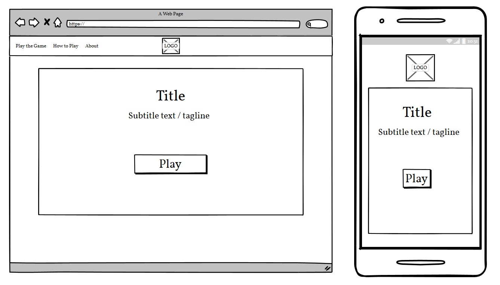
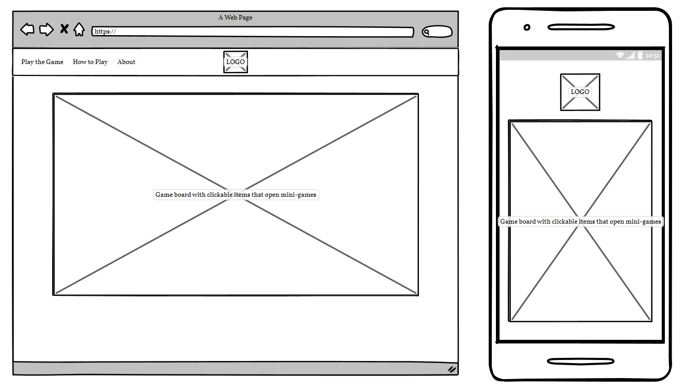
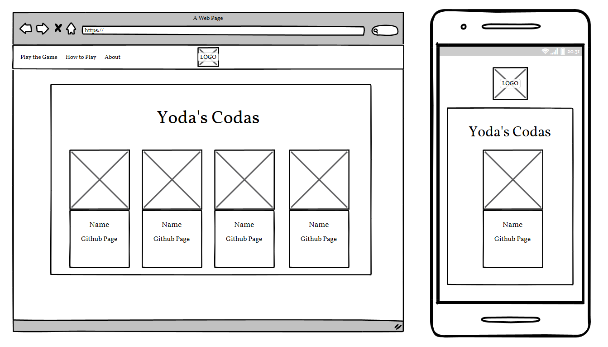

# DeathScape

### Use your Star Wars knowledge to escape the Death Star! In this star wars themed escape room game. Find the hidden mini-games, complete them all to unlock the sealed door and lead the others to safety. Can you escape from the falling ship?

### Deployed link
[Click here to play!](https://alissatroiano.github.io/team-11/)

## TABLE OF CONTENTS
| Section |
| --- |
| [Project description, link, etc.](#deathscape) |
| [Controls and Game Rules](#controls-and-game-rules) |
| [Typography](#typography) |
| [Features](#features) |
| [UX / UI](#uxui-section) |
| [Testing](#testing) |
| [Unfixed Bugs](#unfixed-bugs) |
| [Deployment](#deployment) |
| [Citation of sources](#citation-of-sources) |
| [Future Features](#future-features) |

## CONTROLS AND GAME RULES
### How to play
- Click the play button to start the game
- Search the ship for mini games
- Press on a mini game (hint, it will change colour when hovered over)
- Complete the game to unlock 1 of the 3 padlocks above the door
- Once all the padlocks above the door have changed colour, the door will open and you can escape

## TYPOGRAPHY
- The star wars font used for the title and headers
- Share tech mono font used for body text
- Dosis font used for navigation
- Text colours and background colours are of the following: white text with black backgroun, yellow text with black background, black text with white background or black text with yellow background

## FEATURES
- Header 
    - Contains the navigation links to change from page to page.
- Team page
    - This page shows the team of individuals who collaborated together to make this game
- Links
    - Hovering over links will change its colour slightly
- Gameplay
    - All mini games will be different and fun, while also relating to star wars
- How to play
    - Instructions to help users understand what they must do in order to complete the game

## UX/UI SECTION  
### Project Goals and Desgin choices:
- The goal of this project is to create a fun star wars themed escape room game. 
- There will be a star Wars scrolling style intro text which explains the story of what has happened so far and what you must do.
- A space themed background which relates to star wars as it's set in space with different planets and galaxies. 
- White text in navigation with a transparent background so the the text is easy to read over the space background image.
- As all good websites have, each page will have a navigation menu at the top of the page. This will contain the headings play, how to play, and meet the team. This repetition is said to make user experiences better as users like it when a website has a common theme/layout, so that it then becomes quick and easy to learn and navigate through.
- The first page is naturally the home page. This will have the title of the game along with a play button
- The last page will be meeting the team. As this is the least important section of the website, it makes sense for it to be the last page.
- All games and designs will be animated and remain consistent throughout. 

### User Stories:
- As a new user:  
    - I want to click on the logo and be taken to the home page.
    - I want to click how to play and be provided with instructions on how I play this game.
    - I want to click play and be taken to the game.
    - I want to click on the mini games and be taken to the mini games.
    - I want to click the linkedin and github links in the meet the team section and be taken to the individuals profile.
    - I want the game to be fun

- As a user into star wars:
    - I want to feel as though I am playing a star wars themed escape room and not just a generic escape room

### Wireframes:
| Page | screenshot | Page | screenshot | 
| --- | --- | --- | --- |
| Home page |  | Game page |  |
| Team page|  |     |     |

## TESTING
[Testing can be found here](/testing.md)

## DEPLOYMENT
The project was developed in Gitpod, committed and push to GitHub through using the terminal section in Gitpod.
To deploy this page to GitHub pages from its GitHub repository, the following steps were taken:
1. Log into GitHub
2. From the list of repositories on the screen, select the relevant repository
3. From the menu list near the top below the project name, select settings
4. There will be a nav down the left of the screen. Find pages and select it when found
5. Select the branch dropdown which will say none and change it to main
6. Click the save button to the right of it

How to run this project locally:
1. To clone this project into Gitpod you will need a GitHub account
2. Use the Chrome browser

Then follow the steps:
1. Install Gitpod Browser Extensions for Chrome
2. After installation, restart the browser
3. Log into Gitpod with your Gitpod account
4. Navigate to the project GitHub repository
5. Click the green 'Gitpod' button in the top right corner of the repository
6. This will trigger a new Gitpod workspace to be created from the code in GitHub where you can work locally

## CITATION OF SOURCES
### Media:
- [Yoda Image](https://imgbin.com/free-png/yoda)
- [Darth Maul image](https://www.clipartmax.com/middle/m2i8A0d3G6m2d3G6_darth-maul-by-flower-in-torn-jeans-cartoon/)
- [Whac-a-maul background image created by us using](https://openai.com/product/dall-e-2)
- [Sand heap image](https://www.shutterstock.com/image-vector/heap-sand-isolated-1102885712)
- [Lightsaber](https://codepen.io/alissatroiano/pen/zYmLvYr)

### Content used in website or to help write code: 
- [Inspiration for whac-a-maul mini-game](https://www.youtube.com/watch?v=RTb8icFiSfk&t=1958s)
- [Font used in headings](https://www.cdnfonts.com/star-wars.font)
- [Font used for body](https://fonts.google.com/specimen/Share+Tech+Mono?query=share&category=Monospace)
- [Font used in nav](https://fonts.google.com/specimen/Dosis)
- [Refreshing the mini-game location](https://stackoverflow.com/questions/61710933/random-image-position-when-refresh-page)
- [Contact page](https://www.w3schools.com/howto/howto_css_cards.asp)
- [404 Error Page](https://freefrontend.com/html-css-404-page-templates/)
- [Lightsaber Content](https://screenrant.com/star-wars-lightsaber-color-meaning-canon/#darksaber-black-lightsaber)

## FUTURE FEATURES
- Add extra rooms
- Add extra mini-games
- Add music to mini-games
- Add multiplayer function
- Add difficulty levels
- Add leaderboards
- Add mobile and tablet functionality