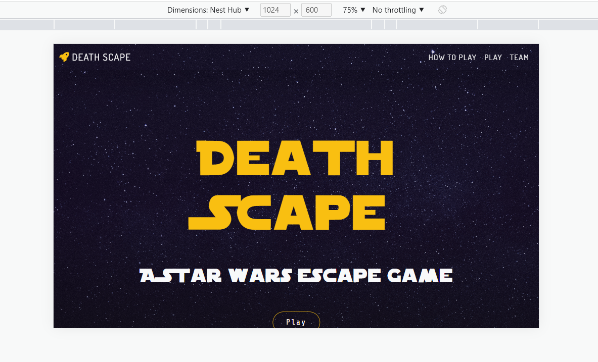
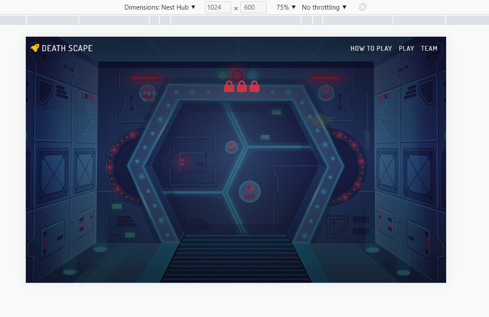
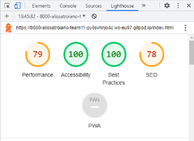
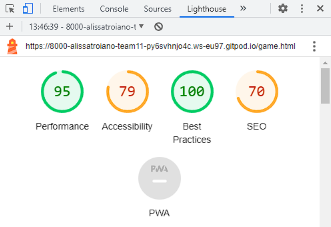

# TESTING

## TABLE OF CONTENTS
| Section |
| --- |
| [Typography Test](#typography-test) |
| [Responsiveness Test](#responsiveness-test) |
| [Browser Compatibility Test](#browser-compatibility-test) |
| [Bugs test](#bugs-test) |
| [Lighthouse Test](#lighthouse-test) |
| [Code Validation Test (HTML)](#code-validation-test-html) |
| [Code Validation Test (CSS)](#code-validation-test-css) |
| [User Stories Test](#user-stories-test) |
| [Features Test](#features-test) |

## Typography test
Typography colour validator used: [https://webaim.org/resources/contrastchecker/]

White font and black backgound = Contrast ratio 21:1 Passed
Black font and white background = Contrast ratio 21:1 Passed
Yellow font (#F9BF11) and black background = Contrast ratio 12.48:1 Passed
Black font and yellow background = Contrast ratio 12.48:1 Passed

## Responsiveness test
The game is designed for large or extra large screens only with the intention to release it for mobile and tablets at a later date.

Tests have been done through the use of DevTools on the browser.

| Device screen width | Extra Small <576px | Small ≥576px | Medium ≥768px | Large ≥992px | Extra Large ≥1200px |
| --- | --- | --- | --- | --- | --- |
| Header / Navigation Responsiveness | N/A | N/A | N/A | Good | Good |
| All Images Responsiveness | N/A | N/A | N/A | Good | Good |
| All Text Responsiveness | N/A | N/A | N/A | Good | Good |
| Gameplay Responsiveness | N/A | N/A | N/A | Good | Good |

### Nest Hub - (L Device):
| Page | Screenshots | Page | Screenshots |
| --- | --- | --- | --- |
| Home page |  | Game page |  |

## Browser compatibility test
The website's appearance, responsiveness and functionality should be the same, regardless of the browser being used.

|   | Chrome | Edge | Safari | 
| --- | --- | --- | --- |
| Intended appearance? | Good | Good | Good |
| Intended responsiveness? | Good | Good | Good | 

## Bugs test
- Not fully operational on mobile and tablets

## Lighthouse test
### Desktop devices:
| Page | Result | Page | Result |
| --- | --- | --- | --- |
| Home page |  | Game page |  |

## Code validation test (HTML)
HTML validator used: [https://validator.w3.org/]

Passed test

## Code validation test (CSS)
CSS validator used: [https://jigsaw.w3.org/css-validator/]

Passed test

## User stories test
| Expect | Action | Result |
| --- | --- | --- |
| As a new user, I want to click on the logo and be taken to the home page | I press on the logo in navigation | I am taken to the home page - Success |
| As a new user, I want to click how to play and be provided with instructions on how I play this game | I press on how to play in the navigation | I am provided with game instructions - Success |
| As a new user, I want to click play and be taken to the game | I click play | I am taken to the game page - Success |
| As a new user, I want to click on the mini games and be taken to the mini games | I press on the mini-game images | I am taken to the mini-games - Success |
| As a new user, I want to click the linkedin and github links in the meet the team section and be taken to the individual's profile | I press on the relevant links in the profile section | I am taken to the individual's github or linkedin profiles - Success |
| As a new user, I want the game to be fun | I play the game and judge how fun it is and whether or not I would play it again | The game was fun, I would play it again - Success |
| As a user into star wars, I want to feel as though I am playing a star wars themed escape room and not just a generic escape room | I play the game and judge how much star wars content is in the game | I am happy with how much the game relates to star wars - Success |

## Features test
| Feature | Expect | Action | Result |
| --- | --- | --- | --- |
| Header navigation links | I expect all the navigation links to work as intended | I press on each navigation link | All links take me to the intended page or display the game rules - Success |
| Team page profiles | I expect this page to show the team of individuals who collaborated together to make this game/project | I press meet the team in the navigation | All team members are shown - Success |
| Team page links | I expect all individual profile links to take me to their respective github and linkedin accounts | I press on the individuals github and linkedin links | The links take me to their respective profile pages - Success |
| Links | Hovering over links will change its colour slightly | I hover over links | The colour changes ever so slightly - Success |
| Gameplay | All mini games to function as intended | I play the mini games | The are no faults or errors - Success |
| How to play | I expect instructions to be given to help me understand what I must do in order to complete the game | I press on how to play in the navigation | I am given clear instructions on what I must do - Success |